# Tech Challenge — Fase 3: Big Data & Analytics no Mercado Brasileiro de Dados

## Visão Geral

Este projeto entrega uma solução completa de Engenharia de Dados e Analytics, aplicada à pesquisa **State of Data Brasil** (edições 2022, 2023 e 2024) e apoia uma Instituição Financeira de grande porte na compreensão do mercado brasileiro de dados, subsidiando decisões estratégicas de contratação, capacitação e investimento em tecnologia. O pipeline foi construído integralmente na AWS, seguindo uma arquitetura moderna de Data Lake em camadas.

---

## Arquitetura da Solução

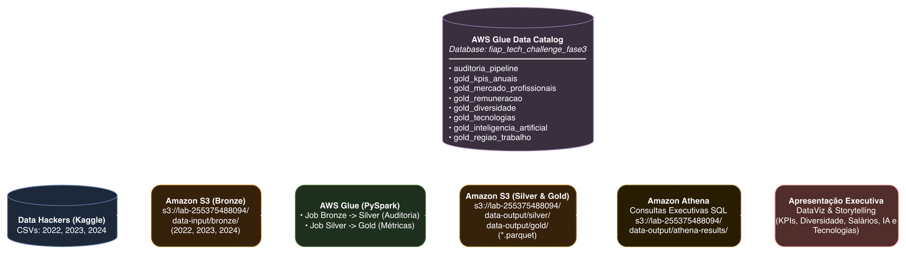

A solução segue o padrão **Medallion Architecture** (Bronze → Silver → Gold), com os seguintes serviços AWS:

| Camada | Serviço | Responsabilidade |
|---|---|---|
| Ingestão | **Amazon S3** | Armazenamento dos CSVs originais na camada Bronze |
| Processamento | **AWS Glue (PySpark)** | ETL, transformações e geração de camadas Silver e Gold |
| Catalogação | **AWS Glue Data Catalog** | Registro de tabelas para consulta via Athena |
| Consulta | **Amazon Athena** | Queries SQL analíticas sobre os dados em Parquet |
| Visualização | **Python / Matplotlib** | Geração dos gráficos executivos |

---

## Pipeline de Dados

```
S3 Bronze (CSV)
    └── glue_bronze_job.py     → Validação e auditoria dos CSVs originais
        └── glue_silver_gold_job.py → Transformação, padronização e enriquecimento
            ├── Silver (Parquet Snappy)   → Dados tratados por ano
            └── Gold  (Parquet Snappy)   → Visão consolidada e analítica
                └── Athena / consultas_athena.sql → Análises e KPIs
                    └── gerar_graficos_executivos.py → Outputs visuais
```

**Fontes de dados utilizadas:**

| Ano | Registros | Colunas |
|---|---|---|
| 2022 | 4.271 | 353 |
| 2023 | 5.293 | 399 |
| 2024 | 5.217 | 403 |

---

## Scripts e Códigos

| Arquivo | Descrição |
|---|---|
| [glue_bronze_job.py](glue_bronze_job.py) | Glue Job PySpark — validação e auditoria da camada Bronze |
| [glue_silver_gold_job.py](glue_silver_gold_job.py) | Glue Job PySpark — ETL completo Bronze → Silver → Gold + catalogação no Glue Data Catalog |
| [consultas_athena.sql](consultas_athena.sql) | Queries SQL analíticas executadas via Amazon Athena |
| [gerar_graficos_executivos.py](gerar_graficos_executivos.py) | Geração dos gráficos executivos (local ou via Glue Python Shell) |

---

## Principais Análises e Gráficos

### 1. Estrutura do Mercado Brasileiro de Dados

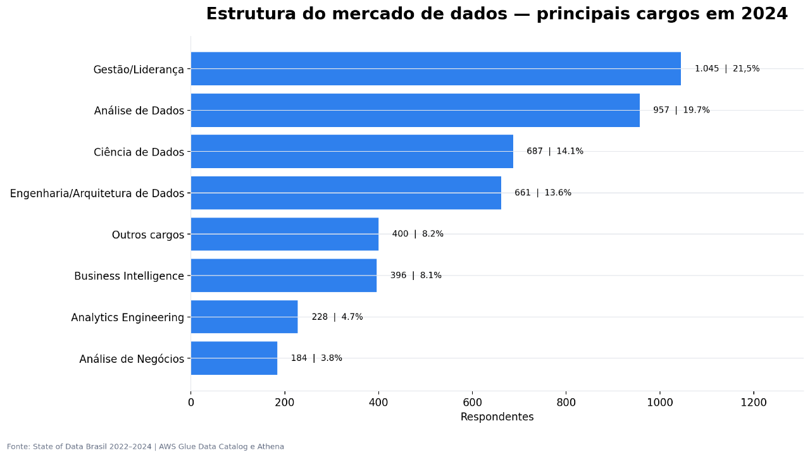

Distribuição dos profissionais por cargo, senioridade e área de atuação ao longo dos três anos de pesquisa, evidenciando o crescimento e maturidade do mercado.

---

### 2. Remuneração por Cargo e Progressão Salarial

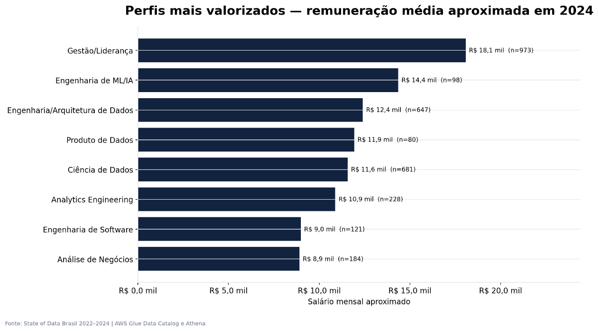

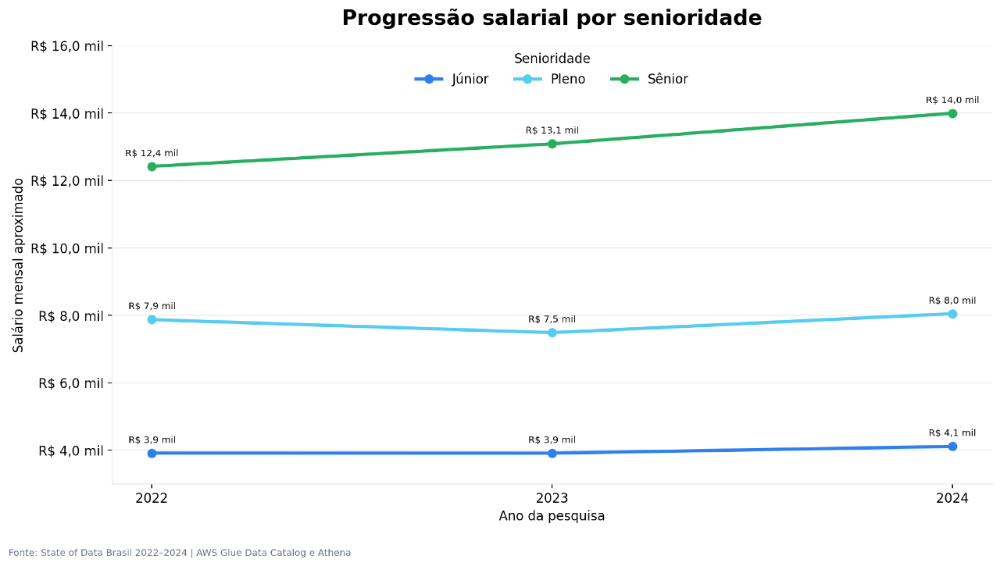

Comparativo de faixas salariais entre os principais papéis (Data Engineer, Data Scientist, Data Analyst, ML Engineer) e a evolução da remuneração média por nível de senioridade entre 2022 e 2024.

---

### 3. Adoção de Tecnologias e Inteligência Artificial

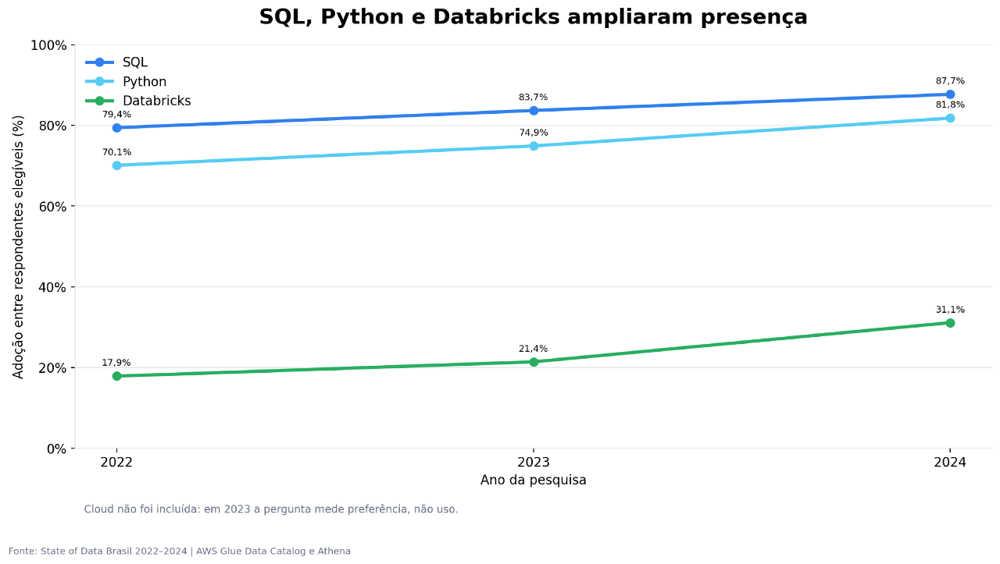

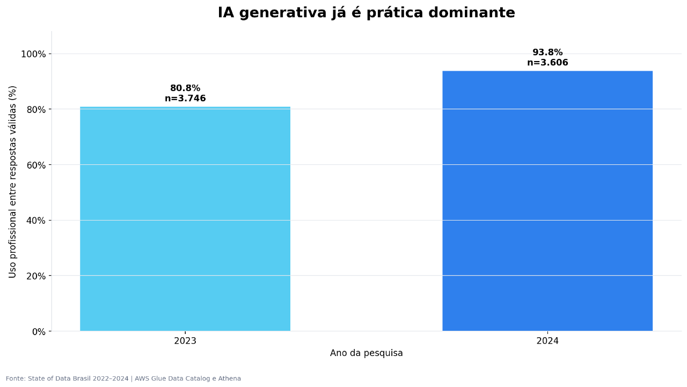

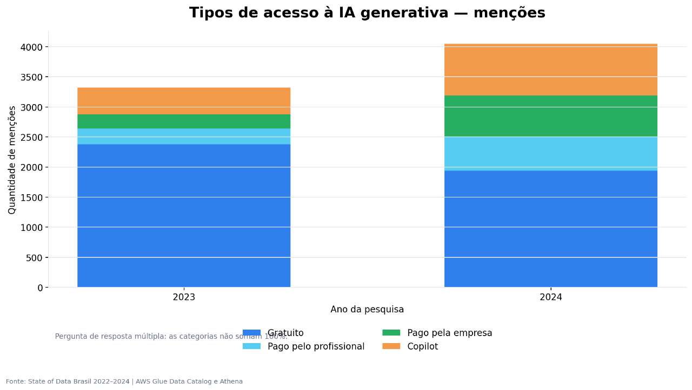

Ranking das ferramentas e linguagens mais utilizadas no ecossistema de dados, com destaque para o índice de adoção de IA Generativa e as formas de acesso (pessoal, corporativo e via API).

---

### 4. Diversidade de Gênero nas Carreiras de Dados

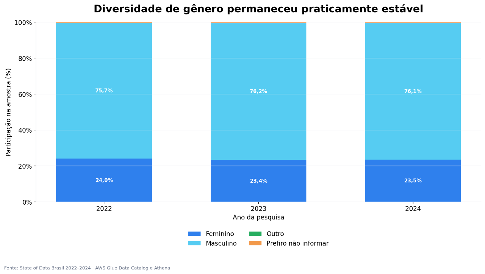

Análise da representatividade de gênero por cargo e faixa salarial, identificando lacunas e oportunidades para políticas de inclusão.

---

### 5. Modelos de Trabalho e Distribuição Regional

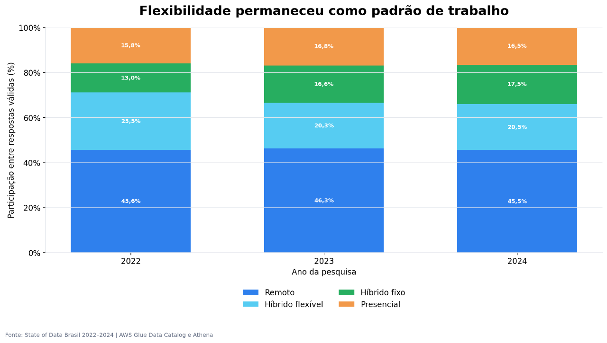

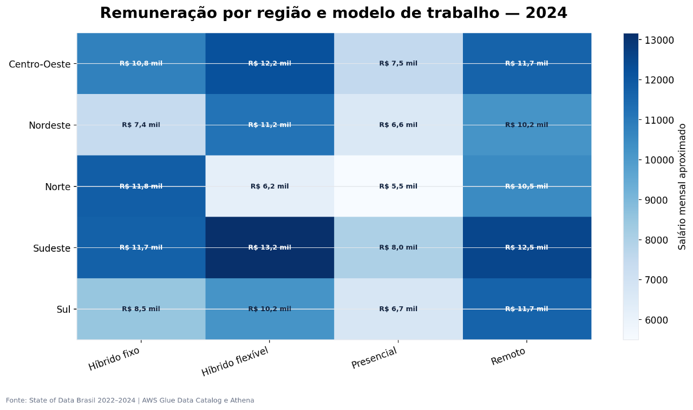

Distribuição entre regimes presencial, híbrido e remoto por região do Brasil, revelando diferenças regionais relevantes para estratégias de recrutamento.

---

### Scorecard Executivo

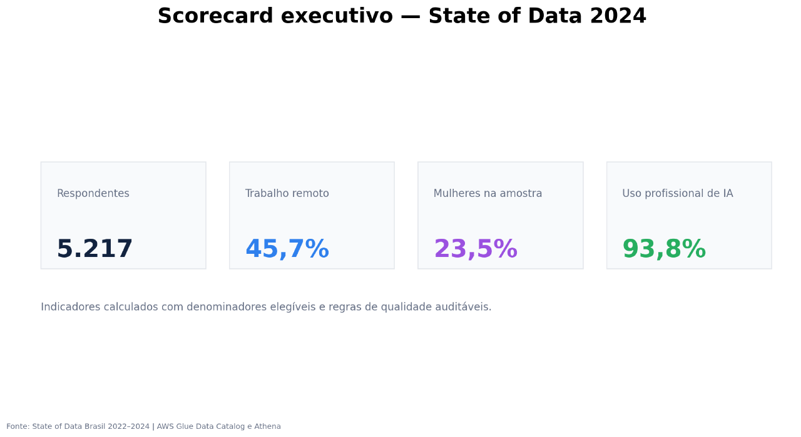

Painel consolidado com os principais KPIs extraídos das três edições da pesquisa, formatado para suporte à tomada de decisão executiva.

---

## Como Executar

### Localmente (geração de gráficos)

```bash
pip install matplotlib pandas boto3
python gerar_graficos_executivos.py --source local
```

### Na AWS (pipeline completo)

1. Fazer upload dos CSVs em `s3://<bucket>/data-input/bronze/`
2. Executar `glue_bronze_job.py` via AWS Glue para validação
3. Executar `glue_silver_gold_job.py` para processamento e catalogação
4. Consultar os dados via **Amazon Athena** usando `consultas_athena.sql`
5. Executar `gerar_graficos_executivos.py` como Glue Python Shell job

```bash
# Parâmetros do Glue Python Shell job
--source athena
--bucket <nome-do-bucket>
--database fiap_tech_challenge_fase3
--athena-output s3://<bucket>/data-output/athena-results/
--s3-output s3://<bucket>/data-output/graficos-executivos/
```

---

## Tecnologias Utilizadas

- **AWS S3** — Data Lake e armazenamento de artefatos
- **AWS Glue** — ETL com PySpark e catalogação de dados
- **Amazon Athena** — Consultas SQL serverless sobre dados em Parquet
- **Apache Spark / PySpark** — Processamento distribuído
- **Python** — Transformações, análises e visualizações
- **Matplotlib / Pandas** — Geração de gráficos executivos
- **Draw.io** — Diagrama da arquitetura
